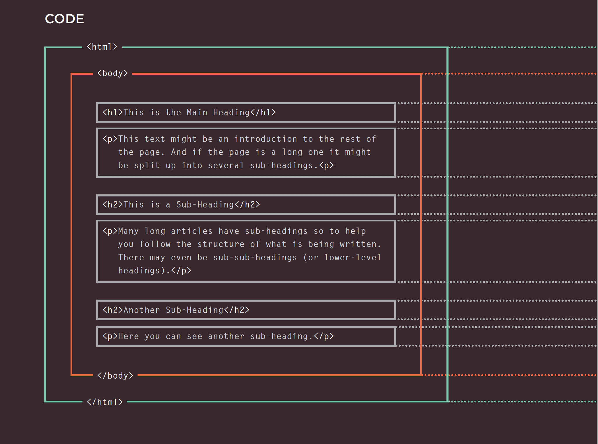
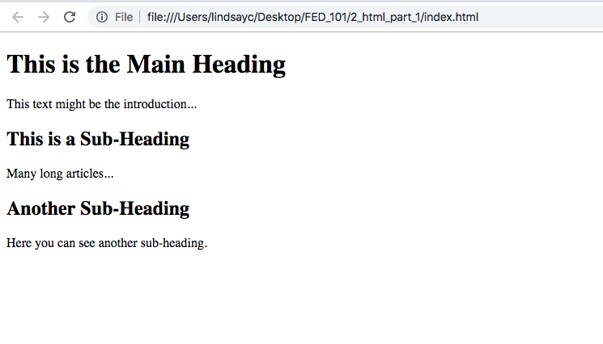
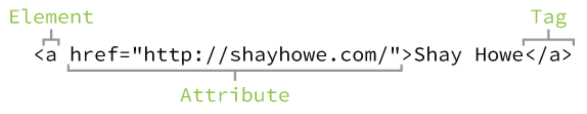
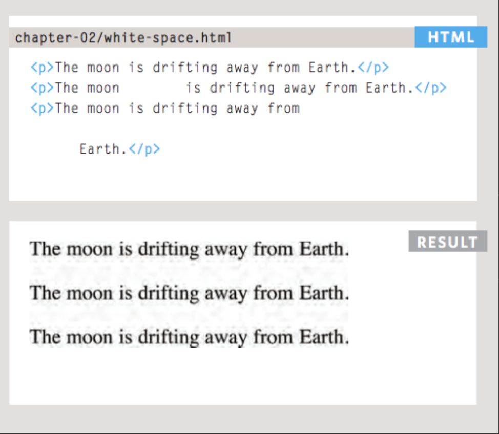
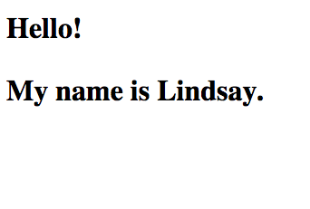
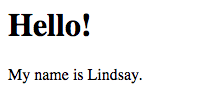
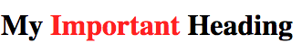

(work in progress)

# HTML Part 1: Structure and Colors
## Meta
_To read these notes_:
* **option 1**: open the class folder and this file in Visual Studio Code. Open the Command Palette (cmd+shift+P or View->Command Palette). Search for and select "Markdown: Open Preview to the Side".
* **option 2**: Go to https://github.com/lindsaycarbonell/fed101 and navigate to the lesson folder.

_Notes adapted from_:
* "HTML & CSS" by Jon Duckett
* 

## What is HTML?
- **HTML** stands for HyperText Markup Language. Like MarkDown (the language I'm using for these notes files), HTML is made up of a set of elements that are translated by another program. In this case, the browser translates those elements into a webpage.
- Every webpage is made up of a set of nested HTML elements that look something like this:

```
<html>
    <body>
        <h1>This is the Main Heading</h1>
        <p>This text might be the introduction...</p>

        <h2>This is a Sub-Heading</h2>
        <p>Many long articles...</p>

        <h2>Another Sub-Heading</h2>
        <p>Here you can see another sub-heading.</p>
    </body>
</html>
```

Notice how every **element** on the page has an opening and closing **tag**:



In the browser, this page looks like this:



## HTML Elements
Let's take a closer look at an HTML element.



Every HTML element is made up of a tag with attributes. The attribute options depend on the tag you are using: for example, even though every HTML tag can have a `style` attribute, only `<a>` tags have `href` attributes.

Within an HTML tag, the browser practices **white-space collapsing**, meaning that it will remove more than 1 consecutive space within the text.



You can write your HTML with or without line breaks separating the opening and closing tags, just make sure you are consistent with what you decide.

## The importance of proper syntax
When writing any code, proper **syntax** is important. A browser may not read your HTML in a way you would expect if it isn't following proper syntax. For example in this code: 

```
<div>
    <h1>Hello!
    <p>My name is Lindsay.</p>
</div>
```

Because the h1 tag is not closed, the browser will not know where the h1 tag ends. So instead of the page having a header and a paragraph as you would expect, instead it looks like this: 



Because the browser wrapped the `<p>` in the `<h1>` tag above it. If you closed the `<h1>` tag, the page would look like this: 



_Let's look at an example page with proper syntax and spacing (trainingindustry.html)_

## Block vs Inline Elements

- **Block elements** always start on a new line and take up the full width available. The most common block element you will see on a webpage is a `<div>`.
- **Inline elements** do not start on a new line and only take up as much space as needed. Inline elements are often nested inside of block elements and have styles attached to them to modify particular content. The most common block element you will see on a webpage is a `<span>`.
- For example, this code: 
```
<h1>My <span style="color:red;">Important</span> Heading</h1>
```
Looks like this:



## Common HTML elements

[Let's take a look](https://docs.google.com/presentation/d/185NQWxEnGUaou-udDUILmu2L4f7qeR0i0tFkMbLw5Dw/edit#slide=id.g464d9ee13b_0_5).

## Semantic Elements


