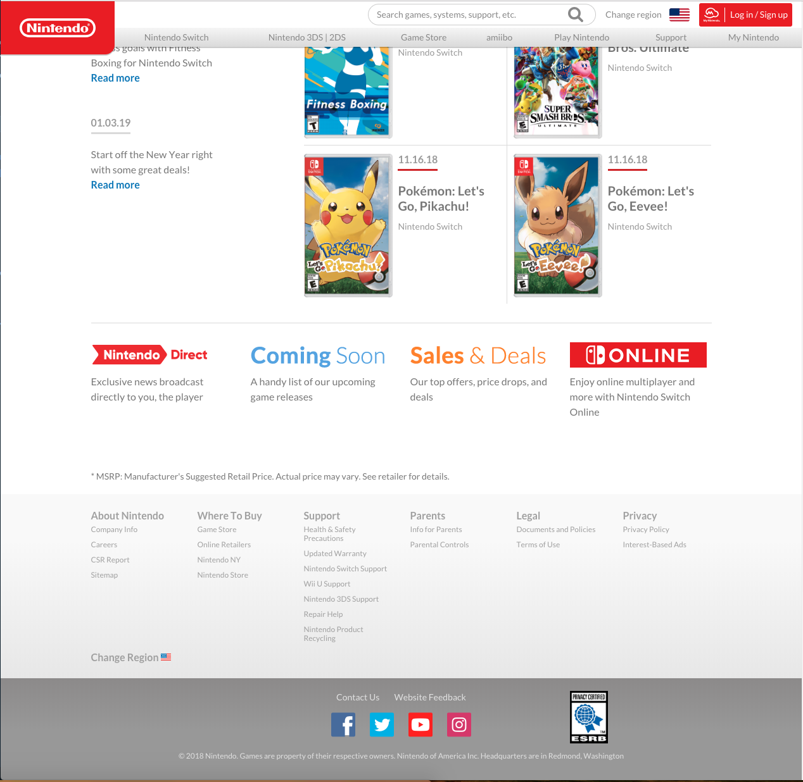
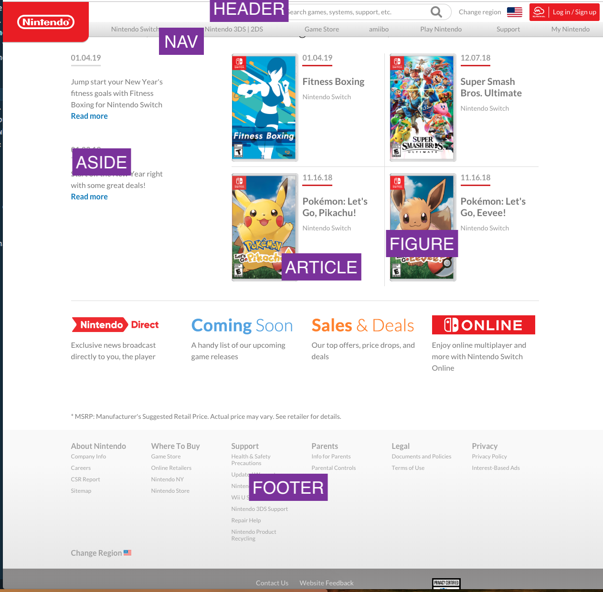

# HTML Part 1: Structure and Semantic Elements
## Meta
_To read these notes_:
* **option 1**: open the class folder and this file in Visual Studio Code. Open the Command Palette (cmd+shift+P or View->Command Palette). Search for and select "Markdown: Open Preview to the Side".
* **option 2**: Go to https://github.com/lindsaycarbonell/fed101 and navigate to the lesson folder.

_Notes adapted from_:
* "HTML & CSS" by Jon Duckett
* [Understanding HTML5 Semantic Elements](https://www.developer.com/lang/understanding-the-proper-way-to-lay-out-a-page-with-html5.html)
- [Interneting is Hard: Semantic Elements](https://internetingishard.com/html-and-css/semantic-html/)
- [W3C Recommendations: Sections](https://www.w3.org/TR/html5/sections.html)
- [Bits of Code: Accessibility Cheat Sheet](https://bitsofco.de/the-accessibility-cheatsheet/)

## What is HTML?
- **HTML** stands for HyperText Markup Language. Like MarkDown (the language I'm using for these notes files), HTML is made up of a set of elements that are translated by another program. In this case, the browser translates those elements into a webpage.
- Every webpage is made up of a set of nested HTML elements that look something like this:

```
<html>
    <body>
        <h1>This is the Main Heading</h1>
        <p>This text might be the introduction...</p>

        <h2>This is a Sub-Heading</h2>
        <p>Many long articles...</p>

        <h2>Another Sub-Heading</h2>
        <p>Here you can see another sub-heading.</p>
    </body>
</html>
```

Notice how every **element** on the page has an opening and closing **tag**:


In the browser, this page looks like this:


## HTML Elements
Let's take a closer look at an HTML element.


Every HTML element is made up of a tag with attributes. The attribute options depend on the tag you are using: for example, even though every HTML tag can have a `style` attribute, only `<a>` tags have `href` attributes.

Within an HTML tag, the browser practices **white-space collapsing**, meaning that it will remove more than 1 consecutive space within the text.


You can write your HTML with or without line breaks separating the opening and closing tags, just make sure you are consistent with what you decide.

When we structure our HTML page we do so based on a number of factors, including: 
- The order we want elements to appear on the page
- How we want elements grouped on the page in a visual and logical hierarchy
- How we want to style our elements
- How we want our browser and user to comprehend our page
When referring to elements on the page, we refer to **parent**, **child** and **sibling** elements. Parent elements contain child elements which are on the same level in a hierarchy as their sibling elements. So for example: 

```
<ul>
    <li></li>
    <li></li>
</ul>
```

In the code above, the `<ul>` is the parent of the two `<li>`'s, which are siblings. These terms will also be important later when we write CSS and JavaScript.

## The importance of proper syntax
When writing any code, proper **syntax** is important. A browser may not read your HTML in a way you would expect if it isn't following proper syntax. For example in this code: 

```
<div>
    <h1>Hello!
    <p>My name is Lindsay.</p>
</div>
```

Because the h1 tag is not closed, the browser will not know where the h1 tag ends. So instead of the page having a header and a paragraph as you would expect, instead it looks like this: 


Because the browser wrapped the `<p>` in the `<h1>` tag above it. If you closed the `<h1>` tag, the page would look like this: 


_Let's look at an example page with proper syntax and spacing (trainingindustry.html)_

## Block vs Inline Elements

- **Block elements** always start on a new line and take up the full width available. The most common block element you will see on a webpage is a `<div>`.
- **Inline elements** do not start on a new line and only take up as much space as needed. Inline elements are often nested inside of block elements and have styles attached to them to modify particular content. The most common block element you will see on a webpage is a `<span>`.
- For example, this code: 
```
<h1>My <span style="color:red;">Important</span> Heading</h1>
```
Looks like this:


## Common HTML elements

[Let's take a look](https://docs.google.com/presentation/d/185NQWxEnGUaou-udDUILmu2L4f7qeR0i0tFkMbLw5Dw/edit#slide=id.g464d9ee13b_0_5).

- If you're following along with these notes outside of class, take time to go through the following slides and look up the documentation for each of the highlighted elements on either MDN or W3. When you're developing sites, you will often have to look up particular elements to remember specific attribute names or standards.
- Note that some of the elements listed in the slides are **deprecated** (no longer used). I've left them in in case you are ever exposed to an out-of-date site that you have to update, but know that standards for HTML5 and CSS3 (and their predecessors) are always changing and sometimes features stop being supported as new features are added.
- As you go through this list, you will notice that some tags are **self-closing tags** (such as `<br>` and ``). These are tags that do not require closing tags. You may put a `/` before the last `>` in the tag (ex: ``) if you wish, but this is no longer necessary as of HTML5.

## HTML5 Semantic Elements
It is important when writing your HTML markup to convey meaning to the browser. You may be tempted to use particular HTML tags because of their default styles -- maybe you want to use an `<h1>` to make text bigger, or an empty `<p>` to add a line break. But when we use HTML tags improperly, we remove meaning from the web page that can be used for: 
- search engine optimization
- accessibility
- having clear code and cleaner CSS

There are some situations when you have to use an HTML element that may not be directly naming the content it is representing, but the goal is to minimize those uses.

When thinking about building a webpage, we want to think about what an outline of the entire page would look like. What would the headers be? Where would we break off the sections? Let's reverse engineer the Nintendo homepage: 



On this page we have a number of elements:



(in class) Let's write out what this page would look like on a basic level in HTML.

## Semantic Elements (as described in the W3C Recommended Usage)

### Sections
> The section element represents a generic section of a document or application. A section, in this context, is a thematic grouping of content. Each section should be identified, typically by including a heading (h1-h6 element) as a child of the section element.

### Articles
> The article element represents a complete, or self-contained, composition in a document, page, application, or site. This could be a magazine, newspaper, technical or scholarly article, an essay or report, a blog or other social media post.

### Asides
> The aside element represents a section of a page that consists of content that is tangentially related to the content of the parenting sectioning content, and which could be considered separate from that content. Such sections are often represented as sidebars in printed typography.

> The element can be used for typographical effects like pull quotes or sidebars, for advertising, for groups of nav elements, and for other content that is considered separate from the main content of the nearest ancestor sectioning content.

### Navigation
> The nav element represents a section of a page that links to other pages or to parts within the page: a section with navigation links

### Headers
> h1–h6 elements must not be used to markup subheadings, subtitles, alternative titles and taglines unless intended to be the heading for a new section or subsection.

### Header
> The `<header>` element represents introductory content for its nearest ancestor main element or sectioning content or sectioning root element. A header typically contains a group of introductory or navigational aids.

### Footer
> The footer element represents a footer for its nearest ancestor main element or sectioning content or sectioning root element. A footer typically contains information about its section, such as who wrote it, links to related documents, copyright data, and the like.

### Figure and Figcaption 
This element is very infrequently used in the HTML that I have seen. Take a quick read through of this documentation just to get an idea of the thought processes you might go through when outlining a page later.
> The figure element represents some flow content, optionally with a caption, that is self-contained (like a complete sentence) and is typically referenced as a single unit from the main flow of the document.

> The figcaption descendant of figure, if any, represents the caption of the figure element’s contents. If there is no child figcaption element, then there is no caption.

> A figure element’s contents are part of the surrounding flow. If the purpose of the page is to display the figure, for example a photograph on an image sharing site, the figure and figcaption elements can be used to explicitly provide a caption for that figure. For content that is only tangentially related, or that serves a separate purpose than the surrounding flow, the aside element should be used (and can itself wrap a figure). For example, a pull quote that repeats content from an article would be more appropriate in an aside than in a figure, because it isn’t part of the content, it’s a repetition of the content for the purposes of enticing readers or highlighting key topics.

## A note on "asides"
An aside is NOT the same thing as a sidebar. [Read this article](https://aastudio.fr/Sidebar-and-Aside-are-different.html).


## Vocabulary
- HTML
- element
- tag
- white-space collapsing
- parent elements
- child elements
- sibling elements
- inline element
- block element
- syntax
- deprecated


