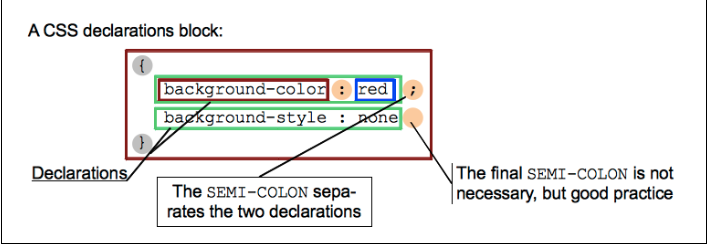

# CSS Part 1: The Basics
_notes adapted from_: 
- [MDN's CSS Property Reference](https://developer.mozilla.org/en-US/docs/Web/CSS/CSS_Properties_Reference)
- [MDN's CSS reference](https://developer.mozilla.org/en-US/docs/Web/CSS/Reference)
- [CSS Combinators](https://www.w3schools.com/css/css_combinators.asp)

## CSS: Cascading StyleSheets
- Cascading: Styles are assigned from the top down
- StyleSheets: style definitions are saved in "sheet(s)" that are connected to your HTML file(s).

## Adding internal styles
- CSS can exist in three locations: 
    - inline CSS
    - internal stylesheet
    - external stylesheet
- **Inline CSS** is attached directly to the element that it is modifying in a style attribute. For example: 
    ```
    <h1 style="font-size:12px;color:red;">Title</h1>
    ```
    Will make this h1 red and have a 12px sized font.
- An **internal stylesheet** is located in the `<head>` in a `<style>` tag. For example: 
    ```
    <head> 
        <style>
            h1 {
                color: red;
                font-size: 12px;
            }
        </style>
    </head>
    ```
- The most common use case for CSS is an **external stylesheet**. In general, you want to keep all of your styles in external stylesheets to keep your code organized and your inheritance easy-to-understand. External stylesheets are separate `.css` files that are referenced in the `<head>` of every page they apply to, using a `<link>` tag.
- Internal styles (either inline or internal stylesheets) are good to use for testing CSS quickly (to be moved to an external sheet later), and when using JavaScript.

## Attaching an external stylesheet
1) Use the `<link>` tag to attach an external stylesheet.
    ```
        <link rel="stylesheet" href="" />
    ```

2) The href attribute will accept relative or absolute URLs. For stylesheets that you create, you'll almost always be using a relative URL. If you use a stylesheet from a **CSS library** online, you'll likely use a **Content Delivery Network (CDN)**, which is represented by an absolute URL. For example, the **Bootstrap** library has a CDN for its stylesheet:
    ```
    <link href="https://stackpath.bootstrapcdn.com/bootstrap/4.2.1/css/bootstrap.min.css" rel="stylesheet" integrity="sha384-GJzZqFGwb1QTTN6wy59ffF1BuGJpLSa9DkKMp0DgiMDm4iYMj70gZWKYbI706tWS" crossorigin="anonymous">
    ```
All you have to do is copy and paste this CDN link and the Bootstrap **CSS** library will be accessible on your page.

3) But in our case, we want to use a relative URL. The URL we will be building is _relative to the file where the <link> tag is_. So if the `style.css` file is in the same directory as our `index.html` where it's being referenced, the link tag will say: 
    ```
        <link rel="stylesheet" href="style.css" />
    ```
But if we put that file in another directory called `css` that is in the same directory as `index.html`, instead we'll have:
    ```
        <link rel="stylesheet" href="css/style.css" />
    ```
    
## CSS syntax
The main function of CSS is setting values of **properties**. This is what basic **CSS ruleset** looks like: 
```
h1 {
    color: red;
}
```
- `h1` is a **selector**
- `{
    color: red;
  }` is a **declaration block**. We could add more declarations to this block if we wanted to.
- `color: red;` is a **declaration**
- `color` is a **property name**
- `red` is a **property value**
- Together, this code means 'Turn all `<h1>`'s red'.



### Common properties
- Different HTML elements can have different properties. For example, while an `h1` and a `p` can have a color, they cannot have a `list-style`, which is a property exclusive to list elements.
- Common properties include:
  - background
  - border
  - color
  - display
  - font-size
  - font-family
  - height
  - margin
  - padding
  - position
  - width
  - visibility
  - z-index
- There are many CSS properties, and you will memorize the main ones, but the most important thing you need to remember is how to read the documentation for a property.
- **The World Wide Web Consortium (W3C)** and the **Mozilla Developers Network (MDN)** are the two primary sources for good web development documentation.
- Google "CSS border" and look at the documentation on W3schools.

### Shorthand

- Some properties have shorthand options. Let's take a look at `border`.

## Selectors
Selectors are the patterns we use to reference HTML elements that we want to style.

### Elements
An element selector is the most simple. We do not need to add anything to our HTML element to write CSS using element selectors. So for this HTML: 

```
<hr />
```

All we need is this CSS to change the width of the horizontal rule to 200px: 

```
hr {
    width: 200px;
}
```

### Classes
A class selector selects all elements with the class attribute and is denoted with a `.`. So for example, for this HTML: 
```
<p class="blue">Blue.</p>
<h1 class="blue">Blue.</h1>
```
We would use this CSS declaration block to make the font color of the `<p>` and `<h1>` blue: 
```
.blue {
    color: blue;
}
```

### IDs
An ID selector selects only one element with that id selector and is denoted by a `#`. While it is convention to only apply the same id to _one_ element on the page, many browsers will accept multiple ids because it is a common enough bug that developers produce.
Regardless, it is _required_ in W3 documentation that you do not duplicate IDs. Later on when we get to JavaScript (and even earlier, using anchor links), having duplicate IDs will break your code.

Example:
```
<div id="container"></div>
```
```
#container {
    max-width: 1170px;
}
```

### Pseudo-classes
Pseudo-classes define special states of elements. The pseudo-classes that you will run into most often are: 
- *:hover*: styles an element when a user mouses over it
- *:focus*: styles an element when it gets focus (usually meaning a user has tabbed to it)
- *:visited* and *:unvisited*: styles visited and unvisited links differently

Hover and focus pseudo-classes are often combined because the visual styles are usually the same. So for instance, if you tab to or hover over a link, it may become underlined and change color. For this HTML:

```
<a class="menu-link">Home</a>
```

The CSS would look like this: 

```
.menu-link:hover, 
.menu-link:active {
    color: green;
    text-decoration: underline;
}
```

#### Child Pseudo-classes
There is a special category of pseudo-class that allows you to target particular children of a parent element. So, for example, with this HTML: 

```
<ul>
    <li>One Fish</li>
    <li>Two Fish</li>
    <li>Red Fish</li>
    <li>Blue Fish</li>
</ul>
```

We can use CSS to target any of the child `<li>` elements without having to add any selectors to those children. Take a look: 

```
li:nth-child(1) { //this selects "One Fish"
    color: red;
}
li:first-child
```

### Pseudoelements

### CSS Combinators
We can combine CSS selectors when we are referencing multiple selectors that use the same styles. We saw some of those examples above in the selectors section. Here are all of the possible combinators: 

- descendant selector (a space)
- child selector  (>)
- adjacent sibling selector (+)
- general sibling selector (~)

Let's go through some examples (in class).

## Vocabulary
- Inline CSS
- Internal stylesheet
- External stylesheet
- CSS library
- Content Delivery Network (CDN)
- Bootstrap
- CSS property
- CSS ruleset
- selector
- declaration block
- declaration
- property name
- property value
- The WorldWide Web Consortium (W3C)
- Mozilla Developers Network (MDN)
- CSS class
- CSS id
- CSS pseudoclass
- CSS pseudoelement


