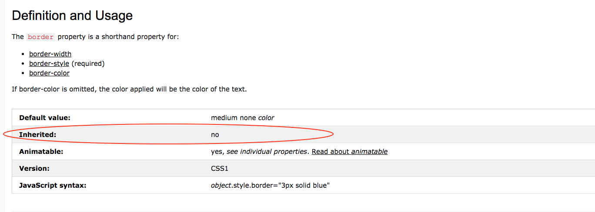

# CSS Part 2: The Cascade
_notes adapted from_:
- [Sarah Hudson's SlideShare](https://www.slideshare.net/shudson4/charlotte-fed-css-inheritance-and-specificity)
- [MDN Specificity](https://developer.mozilla.org/en-US/docs/Web/CSS/Specificity)
- [MDN Cascade and Inheritance](https://developer.mozillab.org/en-US/docs/Learn/CSS/Introduction_to_CSS/Cascade_and_inheritance)
- [Smashing Magazine's CSS Specificity](https://www.smashingmagazine.com/2007/07/css-specificity-things-you-should-know/)
- [W3School's CSS Specificity](https://www.w3schools.com/css/css_specificity.asp)

## KISS
- Keep It Simple Stupid
## DRY
- Don't Repeat Yourself


## Inheritance
All properties in CSS can be inherited by their children, and some properties are inherited by their children by default. Let's take a look at the `color` property, for example. 

```
<div class="container">
    <h1>My Big Title</h1>
    <h3>My Subtitle</h3>
</div>
```

For the HTML above, we can use the container class to apply the same `color` to all its children elements (in this case, the `<h1>` and `<h3>`). All we have to do is set a color on that class: 

```
.container {
    color: purple;
}
```

Now all of the text inside the `.container` element will be purple. But let's say we put a margin on the same class:

```
.container {
    color: purple: 
    margin: 20px;
}
```

By default, the children of `div.container` (the `<div>` with the `container` class) will **not** inherit the 20px margin. Logically, this makes sense. If a 20px margin were to be automatically added to every child, then you wouldn't get the visuals you would expect.

_let's take a look at what that would look like (in class)_

If you are not sure if a property is inherited by default, you can always take a look at the documentation for that property: 



## The Cascade: How Browsers Decide Which CSS to Apply
The cascade is defined by these three things, with 3 overriding 1:
1) Source Order
    - Whichever ruleset comes last will be applied.
2) Specificity
    - Whichever ruleset carries greater weight / more specific selectors will be applied.
3) Importance
    - Whichever ruleset is marked as being more important (with an !important flag) will be applied

### Importance
- Importance is indicated by **important flags** on individual properties within a selector. For example: 
    ```
    h1 {
        color: red!important;
    }
    ```
    Will make all h1's red regardless of all other styles.
- Only use the important flag when you have exhausted all other options.
- The only thing that can override an important flag is a more specific important flag, as defined by the specificity hierarchy.

### Specificity
Specificity is defined by the following hierarchy:

1) _Inline styles_: An inline style is attached directly to the element to be styled, or is in a style tag in the `<head>`.

2) _IDs_: An ID is a unique identifier for the page elements, such as #navbar.

3) _Classes, attributes and pseudo-classes_: This category includes .classes, [attributes] and pseudo-classes such as :hover, :focus etc. **Classes should be used whenever possible instead of IDs and element selectors**.

4) _Elements and pseudo-elements_: This category includes element names and pseudo-elements, such as h1, div, :before and :after.

- Note: The universal selector (*) has no specificity value, meaning anything will override it if set.

### Source Order
With all other specificity and importance rules equal, styles defined later in a stylesheet will override those above it (the styles _cascade_). So for example:
```
h1 {
    color: red;
}

h1 {
    color: blue;
}
```

Because the second h1 definition comes after the first, the h1 color property will be blue.

### A note on the universal selector
- This is a good use and basically the only use I've ever had for the universal selector: 
```
* { 
  -moz-box-sizing: border-box; 
  -webkit-box-sizing: border-box; 
  box-sizing: border-box; 
}
```
- We'll learn about what this means in the next section.


